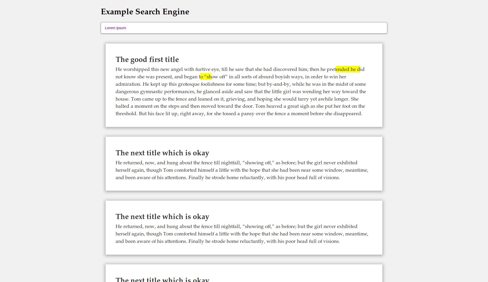

# Rust Search Engine Example
Example full-text search engine written in Rust using Rocket.

*This example is still a work-in-progress*

This repository includes the complete front-end for the search engine, and
mocks a REST interface for querying the search engine. The server is
written in Rust, and uses the Rocket Web Framework. The current plan is
to index a subset of the books from Project Gutenberg and allow those
books to be queried using the REST interface.

In addition to providing the REST interface, the server also serves
static assets (res/favicon.ico and res/index.html). Static assets like
these are commonly served using web servers such as Apache, nginx, or
lighttpd, but were included for completeness.

*This example is licensed under The Unlicense and is released into the public domain. For jurisdictions that do not recognize works being released into the public domain the LICENSE file explicitly grants the same freedoms.*
